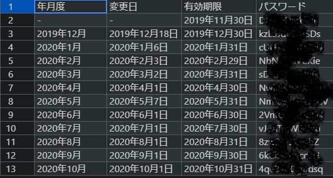

<!-- TOC -->

- [パスワード生成リマインダーについて](#パスワード生成リマインダーについて)
  - [1. シェルスクリプト](#1-シェルスクリプト)
    - [1.1. ファイルの配置](#11-ファイルの配置)
    - [1.2. コード](#12-コード)
      - [注記](#注記)
    - [1.3. 成果物](#13-成果物)
  - [2. cron](#2-cron)
  - [3. .mailrc](#3-mailrc)

<!-- /TOC -->

# パスワード生成リマインダーについて

- このツールは、毎月、月の初めに、パスワードを自動生成し、アカウント利用者にそのパスワードを配信する作業をパスワード生成作業者にメールで注意喚起するリマインダーである
- パスワードは、このリマインダー用シェルスクリプトの中で生成し、その強度はパスワード生成サイト`http://www.luft.co.jp/cgi/randam.php`で生成するパスワードと同程度である
- シェルスクリプト`google_pwgen.sh`は、`CentOS7`のユーザー（例えば`Vuls`）のホームディレクトリーに作成したフォルダー`Google`フォルダーに配置する（シェルスクリプトの所有者は`vuls`とする）
- `cron`設定により、毎月1日に、シェルスクリプトを実行する
- シェルスクリプトでは以下の内容を実行する

1. パスワードを生成する
     - パスワード長は12文字
     - 最低1文字の大文字と数値を含む
     - 完全にランダム
     - 1（イチ）やl（エル）、O（オー）、0（ゼロ）など紛らわしい文字は含めない
2. `Z`ドライブにあるファイル`google-xxxxxxxx-gmail.com.csv`(従来の`Google.txt`を`CSV`形式で記したもの)に、必要な情報とともに生成したパスワードを追記する
3. 宛先を`aaaa@abcd.com`を含むチームのメンバー、`Cc`を`bbbb@abcd.com`とし、生成したパスワードを記述したメールを送信する

## 1. シェルスクリプト

### 1.1. ファイルの配置

- サーバーは、`Ubuntu16.04LTS`
- `/home/vuls/Google/google_pwgen.sh`

### 1.2. コード

```bash
#!/bin/bash
# Usage: ./google_pwgen.sh
# 引数なし
# Google-account, Security は、~/.mailrc に登録されたメールアドレスのエイリアス

export LC_CTYPE=ja_JP.UTF-8

YEAR="`date +%Y`年"		# 2020年
MONTH="`date +%b`"		# 10月
DAY="`date +%-d`日"		# 1日
TODAY="`date +%Y-%m`"	# 2020-10
PWFILE="google_pwgen_${TODAY}.txt"
BASEFILE="base.txt"
MAILFILE="mail.txt"
SUBJECT="[Remind]GoogleAccount"
CC="Google-account"
TO="Security"
ZCSV="/mnt/z/path/to/Google/google-xxxxxxxx-gmail.com.csv"

echo -e "Today is the first day of ${YEAR}${MONTH}. \nGoogle password is: " > $BASEFILE

PW=`pwgen -c -n -s -B 12 1`
echo $PW > $PWFILE
cat $BASEFILE $PWFILE > $MAILFILE
cat $MAILFILE > log/google_pwgen_${TODAY}.log 2>&1

# 2020年10月,2020年10月01日,2020年10月31日,4qe34uQggdsq 追記
ENDOFMONTH=`date +"%Y年%m月%d日" -d "1 days ago \`date +%Y%m01 -d "+1 month"\`"`
ADDLINE="${YEAR}${MONTH},${YEAR}${MONTH}${DAY},${ENDOFMONTH},${PW}"

echo -e $ADDLINE >> $ZCSV

# メール送信
# mail -v　送信ログが、From あてに届く
cat ${MAILFILE} | \
mail \
-s ${SUBJECT} \
-r vuls@abcd.com \   # From
-c ${CC} \
${TO}
```

#### 注記

- `-s (Subject)`に空白は含めないこと
- `-r (From)`に、存在しないアドレスを設定すると送信できない場合がある
  - 送信不可： `-r vuls@abcd.com`
- `-r (From)`に、ダイキン以外のドメインを指定した場合は送信できた
  - 送信可： `-r vuls@vuls.com`


### 1.3. 成果物

1. 配信するメールの内容を記述したファイル

- `/home/vuls/Google/mail.txt`
- 記述例

  ```bash
    Today is the first day of 2020年10月. 
    Google password is: 
    7cav93WuYuXw
  ```

2. 生成したパスワードを記述したファイル

- `/home/vuls/Google/google_pwgen_2020-10.txt`
- 記述例

  ```bash
  7cav93WuYuXw
  ```

3. パスワードを追記する前のベーステキストを記述したファイル

- `/home/vuls/Google/base.txt`
- 記述例

  ```bash
  Today is the first day of 2020年10月. 
  Google password is: 
  ```

4. ログファイル

- `/home/vuls/Google/log/google_pwgen_2020-10.log`
- 記述例

  ```bash
  Today is the first day of 2020年10月. 
  Google password is: 
  7cav93WuYuXw
  ```

5. パスワード変更履歴ファイル

- 従来の`Google.txt`に相当
- `Z:\LVL2\path\to\Google\google-xxxxxxxx-gmail.com.csv`

  


## 2. cron

- `/var/spool/cron/vuls`
- 毎月1日にシェルスクリプト`google_pwgen.sh`を実行する

  ```bash
  [root@localhost ~]# cat /var/spool/cron/vuls
  PATH=/sbin:/bin:/usr/bin:/usr/local/bin:/usr/local/sbin:/usr/sbin:/usr/local/  go/bin:/home/vuls/go/bin:/usr/lib/jvm/java/bin:/opt/apache-tomcat/  apache-tomcat-7.0.50/bin:/home/vuls/.local/bin:/home/vuls/bin:
  MAIL=/var/  spool/mail/vuls
  # 分　時　日　月　曜日　コマンド
  05 6 * * 1-5 /home/vuls/vuls-auto2.sh full diff > /var/log/vuls/vuls-auto.  log 2>&1
  00 15 * * 1-5 /home/vuls/z-today-mail2.sh > /var/log/vuls/z-today-mail.log   2>&1
  00 7 1 * * /home/vuls/Google/google_pwgen.sh > /home/vuls/Google/log/  google_pwgen.log 2>&1
  ```

## 3. .mailrc

- `/home/vuls/.mailrc`
- エイリアス`Google-account`を作成
- `To`に`Security`、`Cc`に`Google-account`を利用しメールを配信する

  ```bash
  # エイリアス
  # Google アカウント
  alias Google-account bbbb@abcd.com
  
  # 管理職
  alias Boss mmmm@abcd.com wwww@abcd.com tttt@abcd.com ssss@abcd.com kkkk@abcd.com
  
  # チーム
  alias Security hhhh@abcd.com oooo@abcd.com mmmm@abcd.com ssss@abcd.com
  ```
